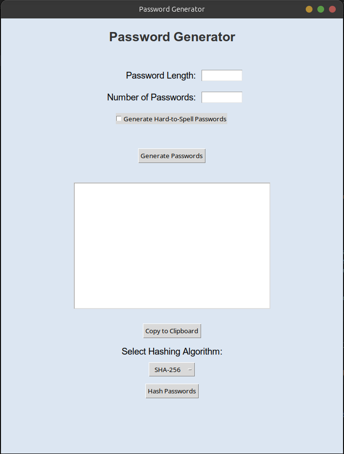

# **Password Generator with GUI**

A feature-rich Python password generator with a sleek and user-friendly GUI built using `tkinter`. This application allows users to create secure passwords of customizable lengths and complexity, generate multiple passwords at once, copy them to the clipboard, and even hash the generated passwords using popular hashing algorithms like SHA-256, MD5, and SHA-1.

---

## **Features**
- **Password Length Selection**: Choose the desired password length.
- **Number of Passwords**: Generate multiple passwords at once.
- **Complexity Option**: Choose between easy-to-spell and more complex (hard-to-spell) passwords.
- **Copy to Clipboard**: Copy the generated passwords directly to your clipboard.
- **Hashing Options**:
  - Hash passwords using different protocols: **SHA-256**, **MD5**, or **SHA-1**.
  - View hashed passwords directly in the app.

---

## **Preview**
### GUI Screenshot:


---

## **Installation Instructions**

1. **Clone the Repository**:
   ```bash
   git clone https://github.com/hiddent3erminal/Password-Generator.git
   cd Password-Generator
   ```

2. **Install the Required Dependencies**:
   Run the following command to install the dependencies:
   ```bash
   pip install -r requirements.txt --break-system-packages
   ```

   If you're running on Linux and encounter clipboard-related issues, install `xclip` or `xselect`:
   ```bash
   sudo apt-get install xclip
   ```
   Or:
   ```bash
   sudo apt-get install xselect
   ```

3. **Run the Application**:
   ```bash
   python main.py
   ```

---

## **Dependencies**
The following libraries are required to run the application:
- `tkinter`: Built-in with Python (for GUI).
- `random` and `string`: Built-in Python libraries for generating random characters.
- `hashlib`: Built-in Python library for hashing.
- `pyperclip`: Third-party library for clipboard support.
  - Install it with:
    ```bash
    pip install pyperclip --break-system-packages
    ```

---

## **How to Use the Application**
1. **Select Password Length**: Enter the desired password length in the text field.
2. **Select Number of Passwords**: Enter how many passwords you want to generate.
3. **Complexity Setting**: Check the option if you want "Hard-to-Spell" passwords.
4. **Click on "Generate Passwords"**: The generated passwords will appear in the text box.
5. **Copy to Clipboard**: Click the "Copy to Clipboard" button to copy the passwords.
6. **Hashing**:
   - Select the desired hashing algorithm from the dropdown (SHA-256, MD5, or SHA-1).
   - Click on "Hash Passwords" to view the hashed version.

---

## **Hashing Algorithms Supported**
- **SHA-256**: A secure, widely-used hashing algorithm.
- **MD5**: A fast but less secure option, used when speed is a priority.
- **SHA-1**: A balance between speed and security.

---

## **Contributing**
Contributions are welcome! If you want to improve the project or add new features:
1. Fork the repository.
2. Create a new branch:
   ```bash
   git checkout -b feature/new-feature
   ```
3. Make your changes and commit:
   ```bash
   git commit -m "Added new feature"
   ```
4. Push to your branch and open a pull request.

---

## **License**
This project is licensed under the MIT License. Feel free to use and modify the code.

---

## **Author**
Developed by **[HiddenT3erminal]**  
GitHub: [github.com/hiddent3erminal](https://github.com/hiddent3erminal)
